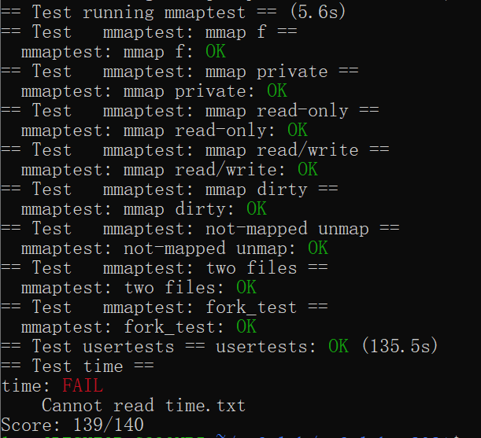

# Lab10

感觉是最麻烦的lab了

整个lab就是在实现mmap这个系统调用

## mmap

首先一通操作把mmap和munmap系统调用注册上去，和lab2类似不再赘述

然后开始实现mmap

* 抄课本，抄一个vma结构体声明，并修改proc

~~~c
#define VMASIZE 16
struct vma {
  int used;
  uint64 addr;
  int length;
  int prot;
  int flags;
  int fd;
  int offset;
  struct file *file;
};
struct proc {
……
struct vma vma[VMASIZE];     // vma of file system
}
~~~

* sysfile里实现mmap，设置参数

~~~c
uint64 sys_mmap(void)
{
  uint64 addr;
  int length, prot, flags, fd, offset;
  struct file *file;
  struct proc *p = myproc();
  // 读参数
  if (argaddr(0, &addr) || argint(1, &length) || argint(2, &prot) ||
      argint(3, &flags) || argfd(4, &fd, &file) || argint(5, &offset))
  {
    return -1;
  }

  // 读写权限判定
  if (!file->writable && (prot & PROT_WRITE) && flags == MAP_SHARED)
    return -1;

  // 检测有没有超出长度
  length = PGROUNDUP(length);
  if (p->sz > MAXVA - length)
    return -1;

  // 找到第一个空vma
  for (int i = 0; i < VMASIZE; i++)
  {
    if (p->vma[i].used == 0)
    {
      p->vma[i].used = 1;
      p->vma[i].addr = p->sz;
      p->vma[i].length = length;
      p->vma[i].prot = prot;
      p->vma[i].flags = flags;
      p->vma[i].fd = fd;
      p->vma[i].file = file;
      p->vma[i].offset = offset;
      filedup(file);
      p->sz += length;
      return p->vma[i].addr;
    }
  }
  return -1;
}
~~~

* 这个实验要求的也是lazy allocated，因此和cow一样，在trap里处理映射导致的读写权限冲突的问题。检查到传入的va没有问题后就给它申请一个新的vma

~~~c
 else if (r_scause() == 13 || r_scause() == 15)
  { // 13是读缺页中断，15是写缺页中断
    // 检查是否超过页大小，是否超过地址，是否越页访问
    uint64 va = r_stval();
    if (va >= p->sz || va > MAXVA || PGROUNDUP(va) == PGROUNDDOWN(p->trapframe->sp))
      p->killed = 1;
    else
    {
      struct vma *vma = 0;
      for (int i = 0; i < VMASIZE; i++)
      {
        if (p->vma[i].used == 1 && va >= p->vma[i].addr && va < p->vma[i].addr + p->vma[i].length)
        {
          vma = &p->vma[i];
          break;
        }
      }
      if (vma)
      {
        va = PGROUNDDOWN(va);
        uint64 offset = va - vma->addr;
        uint64 mem = (uint64)kalloc();
        if (mem == 0)
        {
          p->killed = 1;
        }
        else
        {
          memset((void *)mem, 0, PGSIZE);
          ilock(vma->file->ip);
          readi(vma->file->ip, 0, mem, offset, PGSIZE);
          iunlock(vma->file->ip);
          int flag = PTE_U;
          if (vma->prot & PROT_READ)
            flag |= PTE_R;
          if (vma->prot & PROT_WRITE)
            flag |= PTE_W;
          if (vma->prot & PROT_EXEC)
            flag |= PTE_X;
          if (mappages(p->pagetable, va, PGSIZE, mem, flag) != 0)
          {
            kfree((void *)mem);
            p->killed = 1;
          }
        }
      }
    }
  }
~~~

* lazy allocate 中，当设置虚拟内存和物理内存映射时，可以先不复制虚拟内存；只有实际访问内存时才复制，因此有可能PTE_V位可以0，只有当访问后触发中断复制才设置为1。因此需要去掉uvmunmap和uvmcopy的panic
* 取消掉指定的映射

~~~c
uint64 sys_munmap(void)
{
  uint64 addr;
  int length;
  struct proc *p = myproc();
  struct vma *vma = 0;
  if (argaddr(0, &addr) || argint(1, &length))
    return -1;

  addr = PGROUNDDOWN(addr);
  length = PGROUNDUP(length);

  // 遍历进程的虚拟内存区域列表，查找包含给定地址的VMA
  for (int i = 0; i < VMASIZE; i++)
  {
    if (addr >= p->vma[i].addr || addr < p->vma[i].addr + p->vma[i].length)
    {
      vma = &p->vma[i];
      break;
    }
  }
  if (vma == 0)
    return 0;

  // 如果找到了起始地址
  if (vma->addr == addr)
  {
    vma->addr += length;
    vma->length -= length;

    // 如果vma是共享映射就更新数据
    if (vma->flags & MAP_SHARED)
      filewrite(vma->file, addr, length);
    uvmunmap(p->pagetable, addr, length / PGSIZE, 1);
  }

  // 如果VMA的长度为0，表示已经取消映射完毕
  if (vma->length == 0)
  {
    fileclose(vma->file);
    vma->used = 0;
  }
  return 0;
}
~~~

* 最后，fork需要把映射复制过去，exit需要去掉映射

fork：

~~~c

  // 遍历，把vma复制一遍
  for (int i = 0; i < VMASIZE; i++)
  {
    if (p->vma[i].used)
    {
      memmove(&(np->vma[i]), &(p->vma[i]), sizeof(p->vma[i]));
      filedup(p->vma[i].file);
    }
  }
~~~

exit：

~~~c
  for (int i = 0; i < VMASIZE; i++)
  {
    if (p->vma[i].used)
    {
      if (p->vma[i].flags & MAP_SHARED)
        filewrite(p->vma[i].file, p->vma[i].addr, p->vma[i].length);
      fileclose(p->vma[i].file);
      uvmunmap(p->pagetable, p->vma[i].addr, p->vma[i].length / PGSIZE, 1);
      p->vma[i].used = 0;
    }
  }
~~~

## 实验结果

## 实验小结

又是被lazy allocated折磨的一个实验

难点主要在于对vma理解（va-vma-pa），现在还是理解为类似于用户态-文件态的一个过渡态页表（

每个进程在其虚拟地址空间中都有多个 VMA，每个 VMA 表示一段连续的虚拟地址范围，它可以包含程序的代码段、数据段、堆、栈等。操作系统使用 VMA 来管理虚拟内存的分配、映射和保护。）

然后是各种copy的报错

写完啦！
