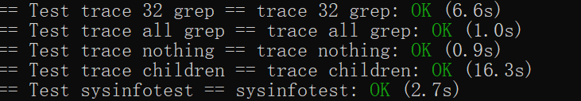

# Lab2

这次实验主要是理解如何进入系统调用。实际操作主要难点在于怎么给实现的系统函数注册进去以及确认注册的正确性

## 前置知识

之所以在实验手册里有这么多麻烦的注册过程，主要是为了将用户态和内核态隔离开来，以此来避免用户态错误的程序影响到其他程序乃至内核程序的正确性。

而系统调用的功能就是让用户态可以申请使用更高等级权限的函数，内核运行后再返回给用户态。整个过程就是：

函数调用某个系统调用->makefile去a7检查系统调用的序号->根据这个序号找系统调用函数的entry-> 完成后从中断返回。

## trace

跟着lab指导一步步来

**首先，修改makefile添加trace**

```makefile
	$U/_trace\
```

**然后，添加声明与注册。**

在user.h添加trace的声明

```
int trace(int);
```

在usys.pl添加entry：

```
entry("trace");
```

在syscall.h中添加系统调用指令码并在syscall.c添加函数模板

```
#define SYS_trace  22
```

```
extern uint64 sys_trace(void);
static uint64 (*syscalls[])(void) ={
	……
	 [SYS_trace] sys_trace,
}
```

**最后，实现sys_trace**

在sys_proc.c中实现

根据实验说明，trace实现方式就是在进程中添加一个变量来记住需要trace什么系统调用。因此，首先在proc.h中添加一个变量mask记录

```c
struct proc {
  struct spinlock lock;

  // p->lock must be held when using these:
  enum procstate state;        // Process state
  void *chan;                  // If non-zero, sleeping on chan
  int killed;                  // If non-zero, have been killed
  int xstate;                  // Exit status to be returned to parent's wait
  int pid;                     // Process ID

  // wait_lock must be held when using this:
  struct proc *parent;         // Parent process

  // these are private to the process, so p->lock need not be held.
  uint64 kstack;               // Virtual address of kernel stack
  uint64 sz;                   // Size of process memory (bytes)
  pagetable_t pagetable;       // User page table
  struct trapframe *trapframe; // data page for trampoline.S
  struct context context;      // swtch() here to run process
  struct file *ofile[NOFILE];  // Open files
  struct inode *cwd;           // Current directory
  char name[16];               // Process name (debugging)
  
  
  int mask;                    // Record process system number
};
```

然后在systrace中为进程添加用户要求trace的系统调用号

arg函数是特有的从用户态读取参数输入

```c
uint64 sys_trace(void)
{
  int n;
  if (argint(0, &n) < 0)
  {
    return -1;
  }
  // set mask
  myproc()->mask = n;
  return 0;
}
```

fork子进程时也要将mask复制进去,在fork()实现中添加一句

```c
 np->mask=p->mask;
```

最后要求打印信息。实验手册说明了在syscall中打印出要添加的信息，并用字符串数组来实现系统调用名和系统调用序号一一映射

（trapframe->a0其实就是是ra寄存器）

注意，syscall序号是从1开始的

```c
// record syscall name:
// attention: the syscall name is start from 1,so 0 is empty string
const char *syscall_name[] = {"", "fork", "exit", "wait", "pipe", "read", "kill", "exec", "fsatat",
                              "chdir", "dup", "getpid", "sbrk", "sleep", "uptime", "open", "write",
                              "mknod", "unlink", "link", "mkdir", "close", "trace","sysinfo"};
void syscall(void)
{
  int num;
  struct proc *p = myproc();

  num = p->trapframe->a7;
  if (num > 0 && num < NELEM(syscalls) && syscalls[num])
  {
    p->trapframe->a0 = syscalls[num]();
    // print systrace info
    //  mask is check by bit
    if (p->mask & 1 << num)
    {
      // print current pid,syscall name and syscall return number.
      printf("%d: syscall %s -> %d\n", p->pid, syscall_name[num], p->trapframe->a0);
    }
  }
  else
  {
    printf("%d %s: unknown sys call %d\n",
           p->pid, p->name, num);
    p->trapframe->a0 = -1;
  }
}

```

## sysinfo

根据实验要求，首先修改makefile在其中添加  $U/_sysinfotest,然后在usys.pl添加entry，在user.h添加声明，在syscall.h添加系统调用序号，在syscall.c中添加序号与系统调用的映射关系，这里就不再赘述了，方法和上面的trace完全一样。

实现如下：其本质是将struct sysinfo复制给用户空间，使用copyout即可。copyout要获取的参数就是进程页表，虚拟地址，拷贝的内存指针和内存大小（memcopy用）

 sysinfo有两个参数，分别和kalloc和proc有关，在kalloc.c和proc.c中实现两个函数（记得在def.h中添加声明），sysinfo调用即可

sysinfo:

```c
uint64 sys_sysinfo(void)
{
  uint64 adr;
  struct sysinfo si;
  si.freemem = freemem();
  si.nproc = procnum();
  if (argaddr(0, &adr) < 0)
  {
    printf("error adr\n");
    return -1;
  }
  if (copyout(myproc()->pagetable, adr, (char *)&si, sizeof(si)) < 0)
    return -1;
  return 0;
}
```

检查还剩多少空余内存的freemem：

在kalloc中，空余内存记录在链表freelist中，遍历页表个数即可

```c
uint64 freemem(void){
  uint64 n=0;
  struct run* ite=kmem.freelist;
  for(;ite!=0;ite=ite->next){
    n+=PGSIZE;
  }
  return n;
}
```

检测进程数procnum：

所有的proc都存在struct proc proc[NPROC];中，遍历一遍检测是否使用即可。

```
uint64 procnum(void){
   uint64 n=0;
  for(int i=0;i<NPROC;i++){
    acquire(&(proc[i].lock));
    if(proc[i].state!=UNUSED){
      n++;
    }
    release(&(proc[i].lock));
  }
  return n;
}
```

## 实验结果



## 实验小结

第一次动手用gdb调试来理解makefile和汇编程序，挺麻烦的，中断处理的时候函数调试和正常的程序运行过程中差别很大，需要layout split来检查gdb跳到哪里了

以及lab的中文翻译看的头都大了，磕磕绊绊才把系统调用注册成功（主要是失败了都不知道是哪里失败了）
