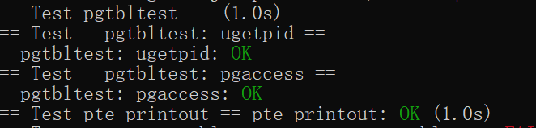

# Lab3

这一个lab主要是理解虚拟地址与物理地址的映射关系。主要是理解三级页表的跳转以及各种标志位

## 前置知识

区分以下知识

**虚拟地址** （virtual address，va）：构成为9+9+9+12.其中前三个9代表了三级页表索引偏移量，最后一个12代表了页内偏移量

**物理地址**（physical address，pa）：44+12，前44是页表地址（最前8位是保留位），后12位是页内偏移量（由va决定）

**页表索引**（page directory）：44+10，前44位是下一个页表的地址，最后10位是权限位（flags）

虚拟地址跳转物理地址的过程就是：首先在satp寄存器中找到第一个页表的地址，然后根据第一个虚拟地址偏移量找到第二级页表的地址，再根据第二个偏移量找到第三级页表索引的地址，再根据第三个偏移量找到物理页表的地址，最后根据offset找到页内地址

在系统调用进入内核态后，页表会切换到内核态页表。这个是所有进程共用的。同时每个进程也有自己的页表(myproc()->pagetable)。

在虚拟地址与物理地址之间映射的时候地址之间大部分是一一映射的，这样可以保证在翻译过程的第一步使用satp内的地址时不会因为从虚拟地址跳到物理地址而导致错误的寻找页表。

## Speed up system call

实验思路是：在系统调用时需要从用户态切换到内核态，这时就会出现trampoline的保存现场的开销。我们希望某些函数能够直接在用户态就能读取内核态的一些数据，这样就避免了保存现场-恢复现场的开销

本质上就是给proc添加一个只读页来记录一些必要数据

首先声明一个usyscall的struct

```c
#define USYSCALL (TRAPFRAME - PGSIZE) //usyscall page addr

struct usyscall {
  int pid;  // Process ID
};
```

然后在proc结构体里添加一个记录这个页表的指针

```c
struct proc{
    ...
    struct usyscall *usyscall; 
    ...
}
```

根据实验要求，修改proc.c，在allocproc里分配这一页面

```c

  //allocate a usyscall page
  if((p->usyscall = (struct usyscall *)kalloc()) == 0){
    freeproc(p);
    release(&p->lock);
    return 0;
  }
  p->usyscall->pid = p->pid;
```

在freeproc里释放这一页面

```c
if (p->usyscall)
    kfree((void *)p->usyscall);
  ...
   p->usyscall = 0;
```

同时和trapframe一起取消映射

```c
void proc_freepagetable(pagetable_t pagetable, uint64 sz)
{
  uvmunmap(pagetable, TRAMPOLINE, 1, 0);
  uvmunmap(pagetable, TRAPFRAME, 1, 0);
  uvmunmap(pagetable, USYSCALL, 1, 0);
  uvmfree(pagetable, sz);
}
```

对于这个页面要记得设置权限。根据题目要求是只读，同时是用户态允许访问的，因此权限是PTE_R|PTE_U.仿造上面的申请过程，如果失败了要释放

``` c
  // allocate extra pages
  // user-used and only readable.
  if (mappages(pagetable, USYSCALL, PGSIZE, (uint64)(p->usyscall), PTE_R | PTE_U) < 0)
  {
    // release former alloc
    uvmunmap(pagetable, TRAMPOLINE, 1, 0);
    uvmunmap(pagetable, TRAPFRAME, 1, 0);
    uvmfree(pagetable, 0);
    return 0;
  }
```

## print a page table

主要是为了让我们理解三级页表的原理，要做的就是遍历一遍页表,写一遍dfs就可以了

注意下一个页表的前44位和页表索引中前44位是一样的，后12位是偏移量，所以PTE2PA就是addr>>10<<12就能找到下一级页表的表头地址

在vm.c中实现vmprint：

```c
const int MAXDEPTH = 2;
void vmprint(pagetable_t pagetable,uint depth){
  if(depth==0){
    printf("page table %p\n", pagetable);
  }

  //a page contain 9 bits
  for(int i=0;i<512;i++){
    pte_t pte = pagetable[i];
    if(pte&PTE_V){
      //valid page
      for(int i=0;i<depth;i++){
        printf("..");
      }
      uint64 nextpteaddr = PTE2PA(pte);
      printf("..%d: pte %p pa %p\n", i, pte, nextpteaddr);
      if(depth<MAXDEPTH){
        vmprint((pagetable_t)nextpteaddr,depth+1);
      }
    }
  }
}
```

## Detecting which pages have been accessed

要求实现一个系统调用，获取用户页虚拟地址，检查的页数（不超过32，因为用int存储页信息），获取结果的地址。

上个lab学了注册，因此这次就直接注册好系统调用直接写实现就行了

首先获取参数

```c
 uint64 st_addr,muskaddr;
  int len;
  if(argaddr(0,&st_addr)<0){
    return -1;
  }
  if(argint(1,&len)<0){
    return -1;
  }
  if(argaddr(2,&muskaddr)<0){
    return -1;
  }
```

然后用walk函数找到要检查的页表

```c
pagetable_t pagetable = myproc()->pagetable;
  pte_t* first_physic_addr = walk(pagetable,st_addr,0);
```

然后检查当前页表下的页的使用情况。根据页表的权限位设定，PTE_A（1<<6)位记录页表使用情况，但需要自己在头文件里定义。

同时根据实验手册提示，PTE_A检查完要清除，不然页面就一直被记录为access过了

最后结果位存储好直接copyout给用户态就行

```c
uint result=0;
  //only check 32 bits of pages
  if(len>32){
    return -1;
  }

  for(int i=0;i<len;i++){
    if((first_physic_addr[i]&PTE_A)&&(first_physic_addr[i]&PTE_V)){
      result|=1<<i;
      //reset pte_A to avoid always checking
      first_physic_addr[i]^=PTE_A;
    }
  }
 // printf("result = %ud\n",result);
  //copy data from kernel to user
  if(copyout(pagetable,muskaddr,(char*)&result,sizeof(uint))<0){
    return -1;
  }
  return 0;
```

## 实验结果

虽然说是过三个测试就行了，但usertest也过了




## 实验小结

问题在于读代码，uint64，pte_t，pagetable_t*等类型不知道实际代表什么意思（没法和上学期课上学的页表概念联系起来），问了gpt加上看了一遍lecture后才理解物理地址，虚拟地址，物理页表，权限位的概念以及为什么PTE2PA宏函数可以直接用移位的方式实现

同时walk函数理解也有困难，在网上查了资料+问了gpt实际的linux系统中walk函数到底是干什么的以及传入参数分别是什么才理解。实际上就是一个物理与虚拟地址映射的关系。

最后也是最坑爹的地方在于位记录不熟练，第一次写的时候没有将记录result归0，查了好半天最后是把十六进制手写成二进制才明白为什么传出来的result是一个负值（即使test中仅仅设置了1<<30）
