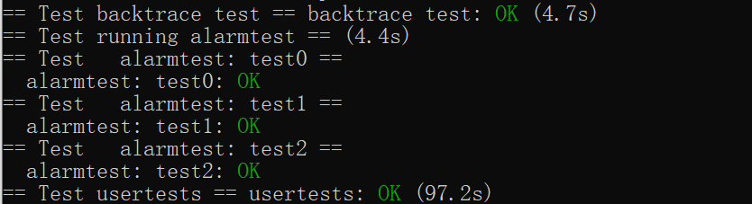

# Lab4

首先先在这里把第一个问答题回答了

## riscv assembly

* Which registers contain arguments to functions? For example, which register holds 13 in main's call to `printf`?

可以看到：

```c
 24:	4635                	li	a2,13
```

说明保存在a1-a7寄存器里

* Where is the call to function `f` in the assembly code for main? Where is the call to `g`? (Hint: the compiler may inline functions.)

编译器直接内联了f，因此main调用的唯一语句为

```assembly
  26:	45b1                	li	a1,12
```

* At what address is the function `printf` located?

相关的汇编如下：

```
30:	00000097          	auipc	ra,0x0
  34:	608080e7          	jalr	1544(ra) # 638 <printf>
```

0x30可以得出ra=pc=0x30，因此printf地址为1544+0x30

* What value is in the register `ra` just after the `jalr` to `printf` in `main`?

代码为

```
 34:	608080e7          	jalr	1544(ra) # 638 <printf>
```

jalr会将pc+4赋给ra，因此ra为0x38(刚好返回到下一条指令)

* Run the following code.

  ```
  	unsigned int i = 0x00646c72;
  	printf("H%x Wo%s", 57616, &i);
        
  ```

  What is the output? Here's an ASCII table that maps bytes to characters.

  The output depends on that fact that the RISC-V is little-endian. If the RISC-V were instead big-endian what would you set `i` to in order to yield the same output? Would you need to change `57616` to a different value?

  Here's a description of little- and big-endian and a more whimsical description

 He110 World, 0x726c6400,e110不用变

* In the following code, what is going to be printed after `'y='`? (note: the answer is not a specific value.) Why does this happen?

  ```c
  	printf("x=%d y=%d", 3);
  ```

y会把a2里的值输出出来（因为参数存在a0，a1，a2）

## 前置知识

这次lab和汇编有关，要搞明白几个寄存器

首先，对于栈帧，大地址在下小地址在上

在函数调用的时候，需要保存调用现场，而实际保存的是ra和sp两个值。具体操作为：fp记录当前函数的栈帧底，fp-8（底部第一个）存储ra，fp-16（底部第二个）存储sp。理解了backtrace就好写了

同时要理解系统调用中断过程。

切换的汇编代码如下：

```
getpid:
 li a7, SYS_getpid
 ecall
 ret
```

首先将该系统调用的调用序号存储到a7寄存器中，然后执行ecall。ecall做如下几件事：

* 从用户态跳转到内核态
* 将pc存在SEPC寄存器
* 跳转到STVEC寄存器指向的指令（这个是内核自己设置好的）

此时pagetable还是用户态，同时栈帧指针也还是在用户态，因此跳转后还要接着处理

STVEC寄存器指向的指令通常是trampoline处理的指令。为了避免当页表从用户态跳转到内核态时地址指向的位置会变（虚拟地址变成物理地址），用户态和内核态的页表映射的trampoline page会指向相同的地址。这样切换页表也不会丢失位置

用户态中断后需要保存现场，所以就把当前状态保存在trapframe中（10-14个寄存器）

接下来要检查trap的原因，可能是错误的代码导致的中断，也可能是设备中断，也可能是时间片轮转导致的中断。在usertrap会检查这个问题并进行相应的处理。

最后会从a7读取注册码然后找到函数进行调用。执行完成后ret将trapframe中的寄存器恢复并跳转到SEPC存储的的pc位置继续执行

## backtrace

简单来说就是写一个dfs，递归搜索fp-16直到不能接着搜。

按实验要求，首先在def添加声明，然后添加如下函数获取当前fp存的值

```c
static inline uint64
r_fp()
{
  uint64 x;
  asm volatile("mv %0, s0" : "=r"(x));
  return x;
}
```

最后在printf.c中实现backtrace

```c
void backtrace(){
  //获取上一个栈帧
  //在riscv中，fp是当前栈帧，fp-8是返回值所在的地址，fp-16是上一帧的地址
  //gcc中，fp被存储在s0寄存器中
  uint64 fp=r_fp();

  //获取当前页的页首,一个栈由于最大只能一页，所以指针不能超过该页
  uint64 top=PGROUNDUP(fp);

  //递归搜索直到栈顶
  for(;fp<top;fp=*((uint64*)(fp-16))){
    printf("%p\n",*((uint64*)(fp-8)));
    
  }
}
```

## alarm

任务要求实现一个系统调用，隔一段时间保存当前现场并调用指定函数，调用后恢复现场

根据要求，像lab2一样注册系统调用sigalarm和sigreturn。然后在proc.h添加新字段记录已经经过的时间，需要经过多久调用函数以及函数指针

```c
  int interval;
  uint64 handle;
  int ticks;
```

并且在allocproc里初始化

```c
  //设置sigalarm
  p->handle=0;
  p->ticks=0;
  p->interval=0;
```

在freeproc里释放

```c
  p->interval=0;
  p->handle=0;
  p->ticks=0;
```


实现系统调用，获取用户指定的参数

```c
uint64 sys_sigalarm(void){
  struct proc* record = myproc();
  int interval;

  uint64 func_addr;
  //获取时间间隔，函数指针和周期
  if(argint(0,&interval)<0){
    return -1;
  }
  if(argaddr(1,&func_addr)<0){
    return -1;
  }
  if(interval<0){
    return -1;
  }
  record->interval=interval;
  record->handle=func_addr;
  record->ticks=0;


  return 0;
}
```

然后在时间中断处理代码里进行修改

epc寄存器记录的就是当前trap处理后要返回的函数地址，直接改成要跳转到的函数即可

```c
 // give up the CPU if this is a timer interrupt.
  if(which_dev == 2){
    //如果有函数调用了alarm
    if(p->interval>0){
      if(p->ticks==p->interval){
         //保存当前现场
        *(p->laststatus)=*(p->trapframe);

        //将函数地址赋给epc，这样中断结束后直接跳转到alarm指定的function
        //由于函数地址用的是用户空间的页表，这里只赋值不执行
        p->trapframe->epc=p->handle;
      }
      p->ticks++;
    }
    yield();
  }
```

test0完成

然后是处理test1，2.实际上就是要保存函数中断时的trapframe，在定时执行函数执行后恢复。注意，这里不能保存中断函数的epc，在函数结束后重新把epc赋值回去，因为函数执行的现场保存在trapframe中。

在proc结构体添加一个记录中断现场的指针

```c
  struct trapframe* laststatus;
```

申请

```c
 //保存现场用,初始化
  if((p->laststatus=(struct trapframe*)kalloc())==0){
    release(&p->lock);
    return 0;
  }
```

释放

```c
  //释放
  if(p->laststatus){
    kfree((void*)p->laststatus);
  }
```

中断时保存现场（上面的代码）

在sigreturn中恢复状态

```c
uint64 sys_sigreturn(void){
  struct proc*p =myproc();
  *(p->trapframe)=*(p->laststatus);
  p->ticks=0;
  return 0;
}
```

## 实验结果



## 实验小结

这个实验如果看了lecture 06后就很好理解了。刚开始处理汇编时头很大，看各种意义不明的地址感觉莫名奇妙的，慢慢读，理解了一些汇编指令后发现代码也非常好读。

然后是理解栈帧，看了lecture06后就理解了重要的两个寄存器（ra和sp）是干嘛的。

遇到的困难在于不能确定栈帧递归到什么时候才结束。问了同一组的同学加上查了资料才知道栈帧只在同一个页表不能跳表查，于是理解了backtrace中最后一条提示是什么意思

alarm遇到的问题在于不知道怎么在中断处跳到要执行的函数。查了好一会资料才发现了epc可以设置跳转地址。

另外遇到的问题就是什么是*(p->trapframe)，想了好一会才理解。trapframe指的是某个函数寄存器现场，因此取地址才能获得现场（刚开始把trapframe指针想成迭代指针了，赋值过来一直报错）
