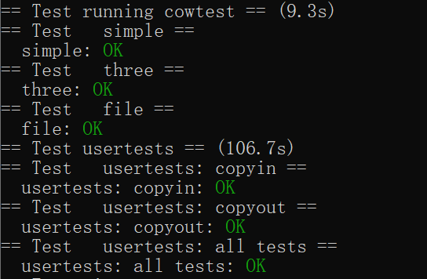

# Lab5

这次实验就是实现一个懒加载过程，只有修改了才真的复制一份进内存

## COW

我们要做的是：在fork的时候并不真的把整块内存复制出去，而是子进程和父进程共享一块内存，只有当某个进程修改了内存时，才将内存复制出去

根据实验要求，首先修改uvmcopy(在vm里），当复制的时候将页面修改为只读

```c
int uvmcopy(pagetable_t old, pagetable_t new, uint64 sz)
{
  pte_t *pte;
  uint64 pa, i;
  uint flags;
  // char *mem;

  for (i = 0; i < sz; i += PGSIZE)
  {
    if ((pte = walk(old, i, 0)) == 0)
      panic("uvmcopy: pte should exist");
    if ((*pte & PTE_V) == 0)
      panic("uvmcopy: page not present");
    pa = PTE2PA(*pte);
    flags = PTE_FLAGS(*pte);
    // if((mem = kalloc()) == 0)
    //   goto err;
    // memmove(mem, (char*)pa, PGSIZE);
    // if(mappages(new, i, PGSIZE, (uint64)mem, flags) != 0){
    //   kfree(mem);
    //   goto err;
    // }
    // 分配映射
    add_ref(PGROUNDDOWN(pa));
    if (*pte & PTE_W)
    {
      /* clear PTE_W */
      *pte &= (~PTE_W);
      /* set PTE_COW */
      *pte |= PTE_C;
    }

    flags = PTE_FLAGS(*pte);
    if (mappages(new, i, PGSIZE, pa, flags) != 0)
    {
      goto err;
    }
  }
  return 0;

err:
  uvmunmap(new, 0, i / PGSIZE, 1);
  return -1;
}
```

(注释的就是修改之前的)

注意，根据提示，我们要添加一个PTE_C标志位来记录当前页面已经被COW而不是真的只读，由于页表地址的8，9，10位是保留位，选一个用来记录即可

然后修改usertrap。查资料可得，当r_scause()==15时就是只读权限导致的中断，此时处理错误

```c
 else if(r_scause()==15){
    //printf("trap into 15\n");
    uint64 fault_va = r_stval();
    if(fault_va>p->sz||check_COW(p->pagetable,fault_va)==-1||cow_alloc(p->pagetable,PGROUNDDOWN(fault_va))==0){
      p->killed=1;
    }
  }
```

check_COW用来检查一些奇奇怪怪的输入，避免错误输入把内核搞坏

```c
// 检查是不是COW,1是0不是
int check_COW(pagetable_t pgtbl, uint64 va)
{
  if (va > MAXVA)
  {
    return 0;
  }
  pte_t *pte;
  if ((pte = walk(pgtbl, va, 0)) == 0)
  {
    return 0;
  }
  // 检查访问
  if ((*pte & PTE_V) == 0)
  {
    return 0;
  }
  // 检查标志
  if (*pte & PTE_C)
  {
    return 1;
  }
  return 0;
}
```

添加一个ref数组，记录每个页面的引用数

```c
struct
{
  struct spinlock lock;
  struct run *freelist;
  uint ref_count[(PHYSTOP - KERNBASE) / PGSIZE];
} kmem;
```


重写kalloc和kfree，将申请释放添加增减引用数操作

```
void *
kalloc(void)
{
  struct run *r;

  acquire(&kmem.lock);
  r = kmem.freelist;
  if (r)
  {
    kmem.freelist = r->next;
    kmem.ref_count[((uint64)r - KERNBASE) / PGSIZE] = 1;
  }
  release(&kmem.lock);

  if (r)
    memset((char *)r, 5, PGSIZE); // fill with junk
  return (void *)r;
}

int get_refcount(uint64 pa)
{
  return kmem.ref_count[(pa - KERNBASE) / PGSIZE];
}
```

```c
void kfree(void *pa)
{
  struct run *r;

  if (((uint64)pa % PGSIZE) != 0 || (char *)pa < end || (uint64)pa >= PHYSTOP)
    panic("kfree");

  r = (struct run *)pa;

  acquire(&kmem.lock);
  kmem.ref_count[((uint64)r - KERNBASE) / PGSIZE]--;
  // 如果被引用为0才清空
  if (kmem.ref_count[((uint64)r - KERNBASE) / PGSIZE] == 0)
  {
    release(&kmem.lock);

    // Fill with junk to catch dangling refs.
    memset(pa, 1, PGSIZE);

    acquire(&kmem.lock);
    r->next = kmem.freelist;
    kmem.freelist = r;
    release(&kmem.lock);
  }
  else
  {
    release(&kmem.lock);
  }
}
```

最后是最麻烦的中断复制，实现如下：

```c
void *cow_alloc(pagetable_t pgtbl, uint64 va)
{
  pte_t *pte = walk(pgtbl, va, 0);
  uint64 pa = PTE2PA(*pte);

  //引用为1时不变
  if(get_refcount(pa) == 1){
    *pte |= PTE_W;
    *pte &= ~PTE_C;
    return (void*)pa;
  }

  //引用大于1时新开一个页面
  uint flags;
  char *new_mem;
 //设置可写
  *pte |= PTE_W;
  flags = PTE_FLAGS(*pte);
  
 
  pa = PTE2PA(*pte);
  new_mem = kalloc();

  
  if(new_mem == 0)
    return 0;

  memmove(new_mem, (char*)pa, PGSIZE);
  //避免panic
  *pte &= ~PTE_V;
  //重映射
  if(mappages(pgtbl, va, PGSIZE, (uint64)new_mem, flags) != 0){
    
    *pte |= PTE_V;
    kfree(new_mem);
    return 0;
  }
	*pte |= PTE_V;
 
  kfree((char*)PGROUNDDOWN(pa));

  return new_mem;
}
```

说明如下：

* 中断进行处理，如果引用为1说明当前页面只是没来得及去掉cow，将页面恢复成普通页面即可
* 引用不为1时需要申请物理内存并memmove当前页面的内存。
* 最后需要将新的物理内存映射到当前进程的虚拟内存上
* 不要忘了kfree旧的cow页面（引用减一）

## 实验结果



## 实验小结

这个实验最头大的在于cow_alloc的实现。首先是PTE_V的问题.刚开始不停报panic总以为是自己写错了，后来发现是因为不能让一个已经映射过的页表再映射一次，所以就直接设置一下权限位来规避这个问题

另外比较头疼的是错误处理，把它放到一个函数里也是为了过usertest方便，可以快速定位修改没考虑到的错误输入

最后是refcount，本来是想额外申请一个新的锁的，但在各种奇奇怪怪的地方锁会报错。最后参考了网上的解决方案放到和kmem一起了
