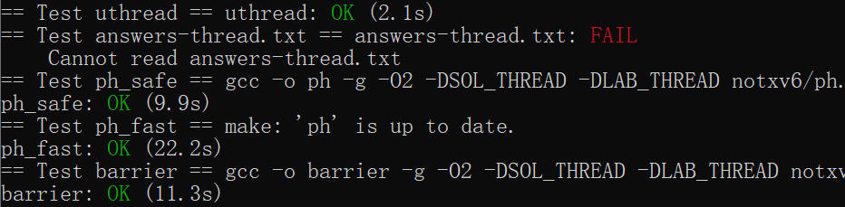

# Lab6

和并发斗争到底的一个lab……

## Uthread: switching between threads

这个lab任务是实现一个用户态下的线程调度

首先在 uthread_switch.S中实现上下文(context)切换（直接抄课上讲义就行）

~~~assembly
	/* YOUR CODE HERE */
	/*抄课上的代码，把当前寄存器的值保存下来，调用下一个线程的上下文*/
	/*a0是第一个参数，即当前线程的位置；a1是下一个线程的ra位置*/
	/*ra记录了中断的位置*/
thread_switch:
	
	sd ra, 0(a0)
    sd sp, 8(a0)
    sd s0, 16(a0)
    sd s1, 24(a0)
    sd s2, 32(a0)
    sd s3, 40(a0)
    sd s4, 48(a0)
    sd s5, 56(a0)
    sd s6, 64(a0)
    sd s7, 72(a0)
    sd s8, 80(a0)
    sd s9, 88(a0)
    sd s10, 96(a0)
    sd s11, 104(a0)

    ld ra, 0(a1)
    ld sp, 8(a1)
    ld s0, 16(a1)
    ld s1, 24(a1)
    ld s2, 32(a1)
    ld s3, 40(a1)
    ld s4, 48(a1)
    ld s5, 56(a1)
    ld s6, 64(a1)
    ld s7, 72(a1)
    ld s8, 80(a1)
    ld s9, 88(a1)
    ld s10, 96(a1)
    ld s11, 104(a1)
	ret    /* return to ra */
~~~

之所以只需要保存这些寄存器是因为这些寄存器是”必要的“，其他寄存器会由内核自动设置

然后声明上下文结构来保存

```c
struct context
{
  // 上下文
  uint64 ra;
  uint64 sp;

  uint64 s0;
  uint64 s1;
  uint64 s2;
  uint64 s3;
  uint64 s4;
  uint64 s5;
  uint64 s6;
  uint64 s7;
  uint64 s8;
  uint64 s9;
  uint64 s10;
  uint64 s11;
};
```

线程的结构体添加上下文的记录

```c
struct thread
{
  char stack[STACK_SIZE];   /* the thread's stack */
  int state;                /* FREE, RUNNING, RUNNABLE */
  struct context t_context; /* 记录线程上下文*/
};
```

在schedule中进行切换

```c
//不是free状态或者main时，需要设置为runable方便切回来
    if (t != &all_thread[0] && t->state != FREE)
    {
      t->state = RUNNABLE;
    }
    // 第一个参数是当前上下文，第二个参数是下一个process的上下文
    thread_switch((uint64)&(t->t_context), (uint64)(&current_thread->t_context));
```

(thread_switch在课上也讲过）

最后create thread时记录一下当前线程的ra和sp即可

```c
void thread_create(void (*func)())
{
  struct thread *t;

  for (t = all_thread; t < all_thread + MAX_THREAD; t++)
  {
    if (t->state == FREE)
      break;
  }
  t->state = RUNNABLE;
  // YOUR CODE HERE
  // 调度的时候直接执行函数
  t->t_context.ra = (uint64)func;
  // 指向栈底，但栈是高向低
  t->t_context.sp = (uint64)&t->stack + STACK_SIZE;
}
```

## Using threads

解决一个并发错误

出错的原因在于有可能两个链表节点同时执行insert插入同一个table里，这样会导致其中一个链表节点丢失（*p被另一个节点的地址覆盖）

虽然理论上可以一把大锁保平安，但相当于串行执行了，所以把锁的粒度减小点，每个bucket一个锁

锁的初始化：

```c
  // 初始化锁
  for (int tmp = 0; tmp < NBUCKET; tmp++)
  {  
    pthread_mutex_init(&(bucket_lock[tmp]), NULL);
  }
```

上锁：

```c
// 多线程出错的原因在于，可能同时对同一个table[i]插入
static void put(int key, int value)
{
  int i = key % NBUCKET;

  pthread_mutex_t *lock = &(bucket_lock[i]);

  // is the key already present?
  pthread_mutex_lock(lock);
  struct entry *e = 0;
  for (e = table[i]; e != 0; e = e->next)
  {
    if (e->key == key)
      break;
  }
  if (e)
  {
    // update the existing key.
    e->value = value;
  }
  else
  {
    // the new is new.
    insert(key, value, &table[i], table[i]);
  }
  pthread_mutex_unlock(lock);
}
```

搜索和插入上锁就保证临界区（table[i]）一次只进一个进程了

## Barrier

实现barrier，即所有线程走到这里必须都停下，全部到齐了再继续走下去。目的是学习使用条件变量

在这里，条件变量的上锁和解锁用了broadcast和wait，wait就是释放当前锁，并让进程进入睡眠；broadcast就是唤醒所有因条件变量而睡眠的进程，并允许进程获取之前释放的锁。

按实验所说，注意不要将下一轮进入barrier的进程影响到上一轮的barrier的nthread记录。因此不能是释放一个进程nthread减一，唤醒后直接置0等下一次运行即可

代码如下：
```c
static void
barrier()
{
  // YOUR CODE HERE
  //
  // Block until all threads have called barrier() and
  // then increment bstate.round.
  //

  // 先锁死互斥量，避免同时访问bstate
  pthread_mutex_lock(&bstate.barrier_mutex);
  // 记录到达当前barrier线程个数
  bstate.nthread++;
  if (nthread == bstate.nthread)
  {
    //恢复状态
    bstate.nthread=0;
    // 唤醒
    bstate.round++;
    pthread_cond_broadcast(&bstate.barrier_cond);
  }
  else
  {
    // 条件变量上锁，mutex释放
    pthread_cond_wait(&bstate.barrier_cond, &bstate.barrier_mutex);
  }

  // 释放
  pthread_mutex_unlock(&bstate.barrier_mutex);
}
```


## 实验结果



answers-thread的回答在第二个实验的说明中写了，就没有另开一个txt记录

## 实验小结

第一个实验和课上讲的例子基本一致，看一遍讲义就能解决大部分hint里的问题了。卡的地方在于怎么让线程去调用指定函数（对ra理解不足）

第二个和第三个lab和期末考的线程题差不多，不过经验不足，第二题本来第一眼打算一把大锁保平安的，但hint提示了需要粒度较小的锁，于是作罢。第三题就是单纯的条件变量实操。

学了南大OS里的状态机模型后对并发以及可能产生的冲突很好理解了，基本没有特别疑惑的问题（反正怕冲突就把可能冲突的共享变量全锁上）