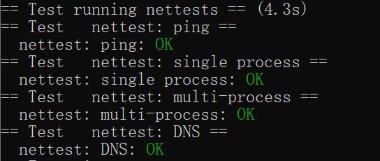

# Lab 7

看起来非常唬人的lab

## networking

这个lab的最大问题在于E1000真的没法读，用了gpt也没法处理。好消息是提示已经是伪代码级的提示了，照着做就行

我们要实现的就是接受和发送数据包。

发包：数据和记录包分成两个环形缓冲区。设置好记录的标识符并保存好数据即可发送。注意，要检查一下上次发送结束没，如果结束就将其中的记录删掉

收包：网卡会直接将接受到的数据写入缓冲区中，然后向cpu发出中断。cpu就可以从缓冲区读取packet传到network stack中。网卡会一次接受所有的packets。

transimit：

唯一要注意的是为什么要设置EOP和RS位

RS：因为不存在多个包发送同一个信息，因此每次发送都需要report status

EOP：因为一个包是1500字节，实验设置缓冲区2048字节，所以不会一个缓冲区发两个包出去

其他按实验要求写下来就行，思路在注释里

~~~c
int e1000_transmit(struct mbuf *m)
{
  //
  // Your code here.
  //
  // the mbuf contains an ethernet frame; program it into
  // the TX descriptor ring so that the e1000 sends it. Stash
  // a pointer so that it can be freed after sending.
  //
  // 上锁
  acquire(&e1000_lock);

  // 获取当前描述符位置
  uint32 index = regs[E1000_TDT];

  // 检查当前描述符是否发送
  if ((tx_ring[index].status & E1000_TXD_STAT_DD) == 0)
  {
    release(&e1000_lock);
    return -1;
  }

  // 清掉上次发送的数据
  if (tx_mbufs[index])
  {
    mbuffree(tx_mbufs[index]);
  }

  // 填写数据
  tx_mbufs[index] = m;

  tx_ring[index].addr = (uint64)m->head;
  tx_ring[index].length = m->len;
  // 第一个是因为在这个实验中是一次性提交所有的mbuf的，所以transmit要中断通知cpu
  // 第二个是因为mbuf只够塞一个数据，因此不会transmit多个数据
  tx_ring[index].cmd = E1000_TXD_CMD_RS | E1000_TXD_CMD_EOP;

  // 设置环形队列队尾符
  regs[E1000_TDT] = (index + 1) % TX_RING_SIZE;

  release(&e1000_lock);
  return 0;
}
~~~

recv：

要注意的点在于一次可以收很多个包，所以不能处理完一个包就跑了

其他按照提示一步步写下来就行

```c
static void
e1000_recv(void)
{
  //
  // Your code here.
  //
  // Check for packets that have arrived from the e1000
  // Create and deliver an mbuf for each packet (using net_rx()).
  //

  // 由于多线程可以一次往后放很多个数据，所以需要连续读读到没有为止
  while (1)
  {
    // 获取当前描述符位置
    uint32 index = regs[E1000_RDT];

    // 获取下一个index的位置
    index = (index + 1) % RX_RING_SIZE;

    // 检查是不是最后一个
    if ((rx_ring[index].status & E1000_RXD_STAT_DD) == 0)
    {
      return;
    }
    // 把len给rx_ring
    rx_mbufs[index]->len = rx_ring[index].length;

    // 把这个mbuf塞到堆栈去
    net_rx(rx_mbufs[index]);

    // 然后用一个新的mbuf塞到之前被扔掉mbuf的位置
    rx_mbufs[index] = mbufalloc(0);
    rx_ring[index].addr = (uint64)rx_mbufs[index]->head;
    rx_ring[index].status = 0;

    // 最后把寄存器index更新一下
    regs[E1000_RDT] = index;
  }
}
```

## 实验结果



## 实验小结

这个实验之所以是hard难度很大是因为需要阅读E1000文档来找到相关的背景知识。尝试读了简介（第二节）和3.3发现理解及其困难，即使让gpt给章节梗概也读的很痛苦。所幸hint提示已经足够多了。用gpt查几个重要的宏定义就能了解hint里没说明的问题了，再在手册里重新看一下说明就知道宏定义是干什么的了（gpt才是真正的manual）

