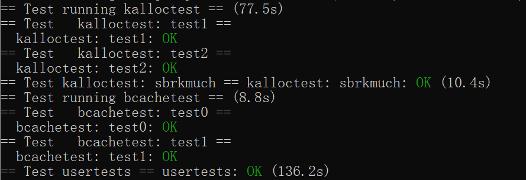

#  Lab8

和死锁斗争到死的lab，整个lab在做的就是把一个大锁拆成几个小锁

## Memory allocator

这个lab任务是将整个共享内存拆成每个cpu一人一个共享内存，然后每个cpu一人一把锁，以此实现优化

首先把内存拆成N个内存：

~~~c
// 为每个CPU设置freelist
struct
{
  struct spinlock lock;
  struct run *freelist;
} kmem[NCPU];
~~~

然后修改kinit，能够正确初始化所有的锁。空闲空间暂时放在一个cpu上，之后再处理

根据提示，把所有锁都命名为kmem也没事

~~~c
void kinit()
{
  //初始化锁
  for (int i = 0; i < NCPU; i++)
  {

    initlock(&kmem[i].lock, "kmem");
  }

  freerange(end, (void *)PHYSTOP);
}
~~~

修改kfree

注意，获取cpuid需要关闭中断

~~~c
void kfree(void *pa)
{
  struct run *r;

  if (((uint64)pa % PGSIZE) != 0 || (char *)pa < end || (uint64)pa >= PHYSTOP)
    panic("kfree");

  // Fill with junk to catch dangling refs.
  memset(pa, 1, PGSIZE);

  r = (struct run *)pa;

  //关闭中断以获取正确的CPUid
  push_off();
  int id = cpuid();
  pop_off();

  acquire(&kmem[id].lock);
  r->next = kmem[id].freelist;
  kmem[id].freelist = r;
  release(&kmem[id].lock);
}
~~~

修改kalloc

如果自己空间不够了就去其他cpu上偷一块空间回来

~~~c
void *
kalloc(void)
{
  struct run *r;
  //关闭中断以获取正确的CPUid
  push_off();
  int id = cpuid();
  pop_off();

  acquire(&kmem[id].lock);
  r = kmem[id].freelist;
  if (r)
    kmem[id].freelist = r->next;
  else{
    //去其他cpu上偷一块freelist
    for(int i=0;i<NCPU;i++){
      //跳过自己
      if(id==i)
        continue;
      //上锁访问
      acquire(&kmem[i].lock);
      r=kmem[i].freelist;
      //偷
      if(r){
        kmem[i].freelist=kmem[i].freelist->next;
      }
      release(&kmem[i].lock);
      //偷到了
      if(r){
        break;
      }
      //在释放的时候，这块地址就会被插入到当前CPU的freelist中
    }
  }
  release(&kmem[id].lock);

  if (r)
    memset((char *)r, 5, PGSIZE); // fill with junk
  return (void *)r;
}

~~~

## Buffer Cache

任务是减小buffer粒度，通过哈希把cache拆成几个，一人一个锁。这样就避免多线程竞争共享cache实现性能提高

修改在bio里

根据提示，需要大锁加小锁避免死锁：

~~~c
struct
{

  struct buf buf[NBUF];
  // 拆成几个bucket
  struct spinlock lock[NBUCKET];
  struct buf head[NBUCKET];

  // 大锁
  struct spinlock biglock;

} bcache;
~~~

同时需要修改buf结构体，通过时间间隔来实现LRU

~~~c
struct buf {
  int valid;   // has data been read from disk?
  int disk;    // does disk "own" buf?
  uint dev;
  uint blockno;
  struct sleeplock lock;
  uint refcnt;
  struct buf *prev; // LRU cache list
  struct buf *next;
  uchar data[BSIZE];
  uint timestamp;
};

#define NBUCKET 13
~~~

初始化锁和链表

```c
void binit(void)
{
  struct buf *b;

  initlock(&bcache.biglock, "biglock");
  for (int i = 0; i < NBUCKET; i++)
  {
    initlock(&bcache.lock[i], "lock");
  }

  for (int i = 0; i < NBUCKET; i++)
  {
    bcache.head[i].next = &bcache.head[i];
    bcache.head[i].prev = &bcache.head[i];
  }

  // 全放到第0个
  for (b = bcache.buf; b < bcache.buf + NBUF; b++)
  {
    b->next = bcache.head[0].next;
    b->prev = &bcache.head[0];
    initsleeplock(&b->lock, "buffer");
    bcache.head[0].next->prev = b;
    bcache.head[0].next = b;
  }
}
```

修改brelse，bpin和bunpin，改成数组

~~~c
void brelse(struct buf *b)
{
  if (!holdingsleep(&b->lock))
    panic("brelse");

  releasesleep(&b->lock);

  int bucketkey = hash(b->blockno);

  acquire(&bcache.lock[bucketkey]);
  b->refcnt--;
  if (b->refcnt == 0)
  {
    // no one is waiting for it.
    // b->next->prev = b->prev;
    // b->prev->next = b->next;
    // b->next = bcache.head.next;
    // b->prev = &bcache.head;
    // bcache.head.next->prev = b;
    // bcache.head.next = b;

    // 由于没有人用，设置最后使用时间
    b->timestamp = ticks;
  }

  release(&bcache.lock[bucketkey]);
}

void bpin(struct buf *b)
{
  int bucketkey = hash(b->blockno);
  acquire(&bcache.lock[bucketkey]);
  b->refcnt++;
  release(&bcache.lock[bucketkey]);
}

void bunpin(struct buf *b)
{
  int bucketkey = hash(b->blockno);
  acquire(&bcache.lock[bucketkey]);
  b->refcnt--;
  release(&bcache.lock[bucketkey]);
}
~~~

在brelse维护timestamp，记录最后一次被使用的时间来实现LRU

修改bget，步骤如下：

* 命中cache，无事发生，返回即可
* 没命中cache，准备存入cache。需要释放小锁锁大锁（为了后面的偷内存）
* 释放小锁和上大锁的中间可能cache更新，重新检查一遍当前cpu内内存（避免了散列到旧块相同的位置）
* 还是没命中，就在当前bucket内根据timestamp找到最后一次使用间隔最久的空闲块，存储
* 没有空闲块，去其他bucket中偷一块来

~~~c
static struct buf *
bget(uint dev, uint blockno)
{
  struct buf *b;
  int time = 0;
  struct buf *SelectFreeBlock = 0;
  int hashkey = hash(blockno);
  acquire(&bcache.lock[hashkey]);

  // Is the block already cached?
  // 如果cached了，直接返回
  for (b = bcache.head[hashkey].next; b != &bcache.head[hashkey]; b = b->next)
  {
    if (b->dev == dev && b->blockno == blockno)
    {
      b->refcnt++;
      release(&bcache.lock[hashkey]);
      acquiresleep(&b->lock);
      return b;
    }
  }
  release(&bcache.lock[hashkey]);

  // Not cached.
  // 避免死锁，先大锁稳住再上小锁
  acquire(&bcache.biglock);

  // 1.检查在重新上小锁的时候当前bucket有没有更新
  acquire(&bcache.lock[hashkey]);
  for (b = bcache.head[hashkey].next; b != &bcache.head[hashkey]; b = b->next)
  {
    if (b->dev == dev && b->blockno == blockno)
    {
      b->refcnt++;
      release(&bcache.lock[hashkey]);
      release(&bcache.biglock);
      acquiresleep(&b->lock);
      return b;
    }
  }

  // 2. 在当前位置根据时间戳找个空闲块返回回去

  for (b = bcache.head[hashkey].next; b != &bcache.head[hashkey]; b = b->next)
  {
    if (b->refcnt == 0 && (SelectFreeBlock == 0 || b->timestamp < time))
    {
      SelectFreeBlock = b;
      time = b->timestamp;
    }
  }
  // 找得到就返回
  if (SelectFreeBlock)
  {
    SelectFreeBlock->refcnt++;
    SelectFreeBlock->dev = dev;
    SelectFreeBlock->valid = 0;
    SelectFreeBlock->blockno = blockno;

    release(&bcache.lock[hashkey]);
    release(&bcache.biglock);
    acquiresleep(&SelectFreeBlock->lock);
    return SelectFreeBlock;
  }

  // 3. 从其他bucket中找一个block返回回去

  for (int tmp = hash(hashkey + 1); tmp != hashkey; tmp= hash(tmp + 1))
  {
    acquire(&bcache.lock[tmp]);
    for (b = bcache.head[tmp].next; b != &bcache.head[tmp]; b = b->next)
    {
      if (b->refcnt == 0 && (SelectFreeBlock == 0 || b->timestamp < time))
      {
        SelectFreeBlock = b;
        time = b->timestamp;
      }
    }
    if (SelectFreeBlock)
    {
      SelectFreeBlock->refcnt++;
      SelectFreeBlock->dev = dev;
      SelectFreeBlock->valid = 0;
      SelectFreeBlock->blockno = blockno;

      // 把这个内存块放到指定哈希队列队首
      SelectFreeBlock->next->prev = SelectFreeBlock->prev;
      SelectFreeBlock->prev->next = SelectFreeBlock->next;
      release(&bcache.lock[tmp]);
      SelectFreeBlock->next = bcache.head[hashkey].next;
      SelectFreeBlock->prev = &bcache.head[hashkey];
      bcache.head[hashkey].next->prev = SelectFreeBlock;
      bcache.head[hashkey].next = SelectFreeBlock;

      release(&bcache.lock[hashkey]);
      release(&bcache.biglock);
      acquiresleep(&SelectFreeBlock->lock);
      return SelectFreeBlock;
    }
    release(&bcache.lock[tmp]);
  }
  release(&bcache.lock[hashkey]);
  release(&bcache.biglock);
  panic("bget: no buffers");
}
~~~

## 实验结果



## 实验小结

和死锁斗争的lab。最痛苦的地方在于代码抄错变量了结果锁会panic（死锁或者typo error），查了很久还以为是锁上的有问题，最后重新读了一遍代码发现是双向链表写错了……

最大的收获是理解怎么解决死锁了。如果每个资源都需要两个资源但可能只拿到一个资源导致死锁，那么就让拿两个资源这个行动变成原子化操作，就不会出现自旋竞争锁了（大锁-小锁拓扑排序确保上锁-解锁是按顺序来的）
