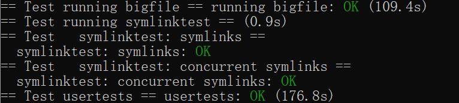

# Lab9

filesystem的补充，写过第三个大作业后理解的很快

## Bigfile

实际上就是实现文件系统的二级映射

首先修改fs.h（磁盘）和file.h（文件系统）中inode结构，给二级映射页表留个位置

~~~c
//二级索引，256*256（block1024，每个索引都是uint）
#define SECONDDIRECT (BSIZE / sizeof(uint))*(BSIZE / sizeof(uint))
#define MAXFILE (NDIRECT + NINDIRECT+SECONDDIRECT)

// On-disk inode structure
struct dinode {
  short type;           // File type
  short major;          // Major device number (T_DEVICE only)
  short minor;          // Minor device number (T_DEVICE only)
  short nlink;          // Number of links to inode in file system
  uint size;            // Size of file (bytes)
  uint addrs[NDIRECT+2];   // Data block addresses
};
~~~

~~~c
// in-memory copy of an inode
struct inode {
  uint dev;           // Device number
  uint inum;          // Inode number
  int ref;            // Reference count
  struct sleeplock lock; // protects everything below here
  int valid;          // inode has been read from disk?

  short type;         // copy of disk inode
  short major;
  short minor;
  short nlink;
  uint size;
  uint addrs[NDIRECT+2];
};
~~~

然后仿照前面的bmap映射写二级映射

~~~c
static uint
bmap(struct inode *ip, uint bn)
{
  uint addr, *a;
  struct buf *bp;

  if (bn < NDIRECT)
  {
    if ((addr = ip->addrs[bn]) == 0)
      ip->addrs[bn] = addr = balloc(ip->dev);
    return addr;
  }
  // 一级索引
  bn -= NDIRECT;

  if (bn < NINDIRECT)
  {
    // Load indirect block, allocating if necessary.
    if ((addr = ip->addrs[NDIRECT]) == 0)
      ip->addrs[NDIRECT] = addr = balloc(ip->dev);
    bp = bread(ip->dev, addr);
    a = (uint *)bp->data;
    if ((addr = a[bn]) == 0)
    {
      a[bn] = addr = balloc(ip->dev);
      log_write(bp);
    }
    brelse(bp);
    return addr;
  }

  // 二级索引
  bn -= NINDIRECT;
  if (bn < SECONDDIRECT)
  {
    if ((addr = ip->addrs[NDIRECT + 1]) == 0)
      ip->addrs[NDIRECT + 1] = addr = balloc(ip->dev);
    bp = bread(ip->dev, addr);
    a = (uint *)bp->data;
    // 检测有没有一级索引
    if ((addr = a[bn / NINDIRECT]) == 0)
    {
      a[bn / NINDIRECT] = addr = balloc(ip->dev);
      log_write(bp);
    }
    brelse(bp);

    // 检测有没有二级索引
    bp = bread(ip->dev, addr);
    a = (uint *)bp->data;
    if ((addr = a[bn % NINDIRECT]) == 0)
    {
      a[bn % NINDIRECT] = addr = balloc(ip->dev);
      log_write(bp);
    }
    brelse(bp);
    return addr;
  }

  panic("bmap: out of range");
}
~~~

最后记得改一下itrunc，抄前面的代码就行

~~~c
void itrunc(struct inode *ip)
{
  int i, j;
  struct buf *bp, *secbp;
  uint *a, *a2;

  for (i = 0; i < NDIRECT; i++)
  {
    if (ip->addrs[i])
    {
      bfree(ip->dev, ip->addrs[i]);
      ip->addrs[i] = 0;
    }
  }

  if (ip->addrs[NDIRECT])
  {
    bp = bread(ip->dev, ip->addrs[NDIRECT]);
    a = (uint *)bp->data;
    for (j = 0; j < NINDIRECT; j++)
    {
      if (a[j])
        bfree(ip->dev, a[j]);
    }
    brelse(bp);
    bfree(ip->dev, ip->addrs[NDIRECT]);
    ip->addrs[NDIRECT] = 0;
  }

  //二级索引释放
  if (ip->addrs[NDIRECT + 1])
  {
    bp = bread(ip->dev, ip->addrs[NDIRECT + 1]);
    a = (uint *)bp->data;
    for (i = 0; i < NINDIRECT; i++)
    {
      if (a[i])
      {
        secbp = bread(ip->dev, a[i]);
        a2 = (uint *)secbp->data;
        for (j = 0; j < NINDIRECT; j++)
        {
          if (a2[j])
            bfree(ip->dev, a2[j]);
        }
        brelse(secbp);
        bfree(ip->dev, a[i]);
        a[i] = 0;
      }
    }
    brelse(bp);
    bfree(ip->dev, ip->addrs[NDIRECT + 1]);
    ip->addrs[NDIRECT + 1] = 0;
  }
  ip->size = 0;
  iupdate(ip);
}
~~~

## Symbolic links

实现类似于快捷方式的软连接（引用）的系统调用

注意，这个快捷方式可以指向另一个快捷方式，也可以指向另一个文件

首先注册这个系统调用，和lab2一样不再赘述

然后按照实验手册要求添加两个符号标志位，一个标志这个文件是”软连接“，另一个是要求打开”软连接“文件而不是去跟着快捷方式搜索到指定的文件

然后实现symlink系统调用，处理参数并创建一个”快捷方式文件“

~~~c
uint64 sys_symlink(void){
  char path[MAXPATH],target[MAXPATH];
  struct inode* ip;
  if(argstr(0,target,MAXPATH)<0)
    return -1;
  if(argstr(1,path,MAXPATH)<0)
    return -1;
  //开始事务
  begin_op();
   // 为这个符号链接新建一个 inode
  if((ip = create(path, T_SYMLINK, 0, 0)) == 0) {
    end_op();
    return -1;
  }
  // 在符号链接的 data 中写入被链接的文件
  if(writei(ip, 0, (uint64)target, 0, MAXPATH) < MAXPATH) {
    iunlockput(ip);
    end_op();
    return -1;
  }

  //commit
   iunlockput(ip);
   end_op();
   return 0;
}
~~~

最后根据实验手册要求修改open函数

* 由于快捷方式可以指向另一个快捷方式，因此可以成环。为了避免这个问题根据实验手册要求设置了搜索深度为10

~~~c
 while(ip->type==T_SYMLINK&&!(omode&O_NOFOLLOW)){
    searchtime++;
    //防止链接成环，设置上限为10
    if(searchtime>=10){
      iunlockput(ip);
      end_op();
      return -1;
    }
    // 读取对应的 inode存储的target路径
    if(readi(ip, 0, (uint64)path, 0, MAXPATH) < MAXPATH) {
      iunlockput(ip);
      end_op();
      return -1;
    }
    iunlockput(ip);
    // 根据文件名称找到链接上的的 inode
    if((ip = namei(path)) == 0) {
      end_op();
      return -1;
    }
    ilock(ip);
  }

~~~

## 实验结果

## 实验小结

第一个实验在写了文件系统后感觉难度不高，基本是照着前面的申请过程抄一遍就行了。唯一一个报错在忘了改MAXFILE

第二个实验最重要的思想是要理解“快捷方式”也是一种特殊的文件（NOFOLLOW宏定义想了很久才明白）。它的内容就是指向的文件路径（path）

看了南大OS的文件系统知道了symlink是可以成图的，所以理解为相当于写了一个链表图
